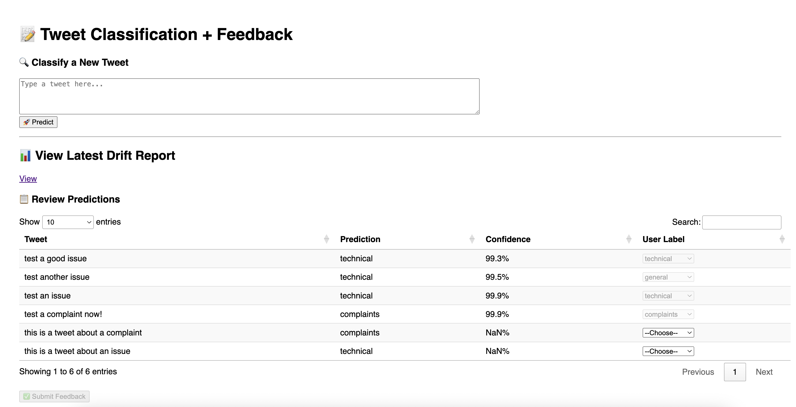

# 🐦 Tweet Classification MLOps Pipeline

A production-grade MLOps pipeline for tweet sentiment classification — built with FastAPI, MLflow, Prefect, Evidently, and PostgreSQL.

This project showcases the full ML lifecycle: from model training and experiment tracking to API deployment and automated monitoring.

---

## 🚀 Features

- **Tweet Classification**: Predict tweet sentiment (positive/negative) using a scikit-learn pipeline.
- **MLflow Integration**: Track experiments, register models, and serve them via FastAPI.
- **Model Registry & Loading**: Dynamically load latest model version via MLflow.
- **Monitoring Pipeline**: Generate and visualize Evidently reports (data drift, classification quality).
- **Automated Testing**: Lightweight integration tests with pytest.
- **Modular Design**: Clear separation of `src/` code and `tests/`, supporting scalability.

---

## 🛠️ Stack

| Layer            | Tool(s)                                   |
|------------------|-------------------------------------------|
| 🧠 Model         | Scikit-learn, TF-IDF, LabelEncoder        |
| 📊 Monitoring    | Evidently                                 |
| ⚙️ Orchestration | Prefect 2                                 |
| 📦 Tracking      | MLflow                                    |
| 🌐 API           | FastAPI + Uvicorn                         |
| 🛢️ Storage       | PostgreSQL (via Docker Compose)           |
| 🧪 Testing       | Pytest + Faker                            |

---

## 🐳 Quickstart (via Docker Compose)

1. Clone the repo:
    ```bash
    git clone https://github.com/skayikci/tweet-classfication-mlops.git
    cd tweet-classfication-mlops
    ```

2. Start everything:

    1. Make sure Docker is running.
    2. Using make command:
    ```bash
    make run
    ```
    Or directly with Docker Compose:
    ```bash
    docker-compose up --build
    ```

3. Access services:
    - API: `http://localhost:8000/docs`
    - MLflow UI: `http://localhost:5555`
    - Prefect Orion: `http://localhost:4200`
    - PostgreSQL: `localhost:5432` (see `.env` for credentials)

---

## ⚙️ Project Structure

```bash
.
├── monitoring/                    # Evidently monitoring flow
├── src/
│   ├── tweet_classification.py    # Training & inference logic
│   ├── api.py                     # FastAPI app with prediction endpoints
├── tests/                         # Pytest-based integration & unit tests
├── data/                          # Sample datasets and reports
├── docker-compose.yml
└── requirements.txt
```

---
## 👁️ Setup instructions (Local dev)
```bash
# Create a virtual environment
python3 -m venv venv
source venv/bin/activate
# Install dependencies
pip install -r requirements.txt
```

---

## 🚆 Model Training & Inference
1. Make sure Docker is running.
2. Using make command:
   ```bash
   make orchestrate
   ```
   Or directly with Python:
   ```bash
   python src/tweet_classification.py
   ```
This will train the model and save it to MLflow as seen in the MLflow UI.
<p align="center">
  
</p>

## 🏆 Selecting the best model
1. Make sure Docker is running.
2. The orchestration flow will automatically select the best model based on the evaluation metrics. And tag it as `production` with an alias.

<p align="center">
  
</p>

3. Then this model will be served via FastAPI, ready for predictions as seen in code:
```python
try:
    logger.info(f"📡 Connecting to MLflow at {MLFLOW_TRACKING_URI}")
    model_uri = f"models:/{MODEL_NAME}@production"
    logger.info(f"📦 Loading model from MLflow URI: {model_uri}")
    model = mlflow.pyfunc.load_model(model_uri)
    logger.info("✅ Model loaded from MLflow.")
except Exception as e:
    logger.exception(f"❌ Failed to load model from MLflow. {e}")
    raise
```

## 🧪 Run Tests

1. Make sure Docker is running.
2. Using make command:
  1. Using make command:
  ```bash
  make test
  ```
  2. Or directly with pytest:
  ```bash
  PYTHONPATH=. pytest tests -v
  ```

---

## 📊 Generate Monitoring Reports

1. Make sure Docker is running.
2. Generate reports
  1. Using make command:
  ```bash
  make monitoring
  ```
  2. Or directly with Prefect:
  ```bash
  python monitoring/monitoring_flow.py
  ```

This saves an interactive HTML report to `data/monitoring/`.

---

## 📥 Sample Prediction

1. Go to the web page for prediction and user input:
```bash
http://localhost:8000/
```
You can enter a tweet text and get the sentiment prediction.
<p align="center">
  
</p>

This website also has latest drift report of the model, which is generated by Evidently.

2. Alternatively, use the API directly:

```bash
curl -X POST http://localhost:8000/predict \
  -H "Content-Type: application/json" \
  -d '{"text": "This product is amazing!"}'
```

Or simply use the Swagger UI at `http://localhost:8000/docs`.


---

## 📌 Use Cases

- Demonstrating **end-to-end MLOps workflows**
- Teaching **monitoring and reproducibility**
- Testing ML APIs in **Dockerized setups**
- Preparing for **production-grade ML deployment**

---

## ℹ️ Additional Information
- For further details, checkout assets in the `assets/` directory for category distribution, confusion matrix, and more.

---

## 🧠 Author

Built with love by [Serhat Kayıkçı](https://serhat.tech)
---
