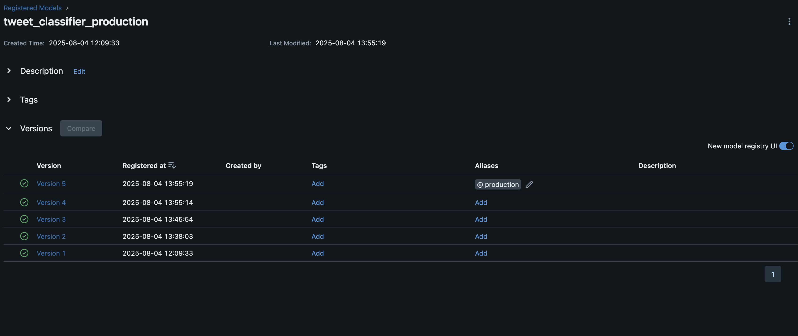

## Model Selection & Orchestration Summary

Multiple models were trained using TF-IDF + {LogisticRegression, RandomForest, NaiveBayes, SVM}.
All experiments were tracked and compared using MLflow.

**Best result:**

<p align="center">
  
</p>

---

## Category distribution
<p align="center">
  
</p>

---
## Confusion Matrix
<p align="center">
  
</p>    

---

## MLFlow Overview

<p align="center">
  
</p>
---

## Workflow Orchestration with Prefect

The entire ML pipeline is orchestrated using [Prefect](https://www.prefect.io/). The workflow automates:
- Data loading and preprocessing
- Exploratory Data Analysis (EDA)
- Baseline model training
- Model comparison and hyperparameter tuning
- Model registration in MLflow

### How to run the Prefect pipeline

```bash
# Run the full pipeline (from project root)
make orchestrate
# or directly
python src/prefect_flow.py
```

Each step is modular and can be reused or extended. The pipeline is defined in `src/prefect_flow.py` and uses tasks that call functions from `src/tweet_classification.py`.

### MLflow UI

To view all experiment runs, metrics, and model registry:

```bash
mlflow ui
# Then open http://localhost:5000 in your browser
```

---

### Optional Cleanup Script

```bash
# keep only the latest timestamped model artifacts
ls -t models/*_model.pkl | tail -n +2 | xargs rm -f
ls -t models/*_vectorizer.pkl | tail -n +2 | xargs rm -f
ls -t models/*_label_encoder.pkl | tail -n +2 | xargs rm -f
```